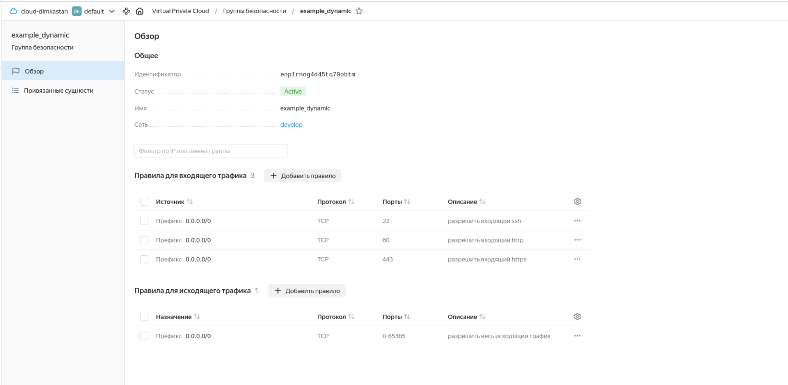
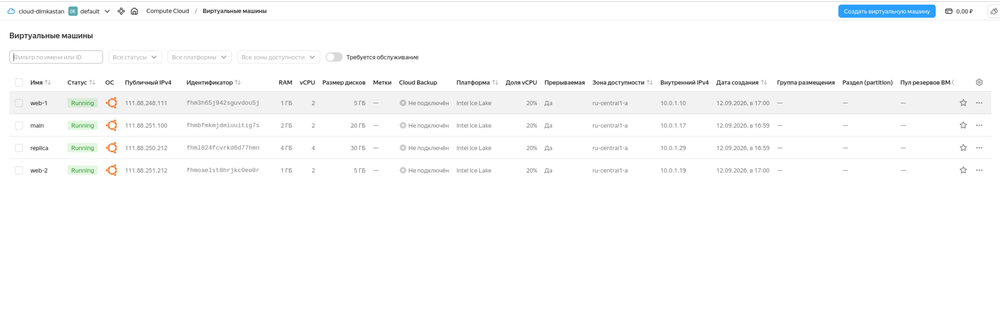
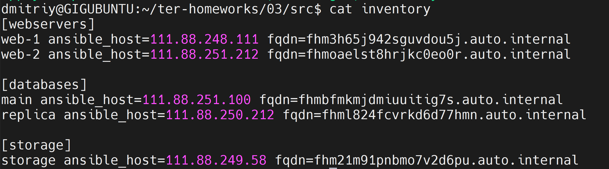

# «Управляющие конструкции в коде Terraform»

## Задание 1

Проект инициализирован и выполнен:

Созданы: `yandex_vpc_network.develop`, `yandex_vpc_subnet.develop`, `yandex_vpc_security_group.example`.

Входящие правила группы безопасности `example_dynamic` (TCP 22, 80, 443 с источником `0.0.0.0/0`):



## Задание 2

### count-vm.tf

Две одинаковые ВМ `web-1` и `web-2` через мета-аргумент `count`. Нумерация через `count.index + 1`, чтобы имена начинались с единицы.
Группа безопасности из задания 1 назначена через `security_group_ids` в блоке `network_interface`.

```hcl
resource "yandex_compute_instance" "web" {
  count = var.vm_web_count

  name        = "web-${count.index + 1}"
  platform_id = "standard-v3"
  zone        = var.default_zone

  resources {
    cores         = var.vm_web_resources.cores
    memory        = var.vm_web_resources.memory
    core_fraction = var.vm_web_resources.core_fraction
  }

  network_interface {
    subnet_id          = yandex_vpc_subnet.develop.id
    nat                = true
    security_group_ids = [yandex_vpc_security_group.example.id]
  }

  metadata = local.ssh_metadata

  scheduling_policy {
    preemptible = true
  }

  depends_on = [yandex_compute_instance.db]
}
```

### for_each-vm.tf

Две ВМ для баз данных — `main` и `replica` — с разными cpu/ram/disk_volume, через `for_each`. 
Параметры вынесены в общую переменную `each_vm` типа `list(object({...}))`.
Так как `for_each` не принимает список, он преобразуется в map выражением `{ for vm in var.each_vm : vm.vm_name => vm }`.

```hcl
resource "yandex_compute_instance" "db" {
  for_each = { for vm in var.each_vm : vm.vm_name => vm }

  name = each.value.vm_name

  resources {
    cores         = each.value.cpu
    memory        = each.value.ram
    core_fraction = each.value.core_fraction
  }

  boot_disk {
    initialize_params {
      image_id = data.yandex_compute_image.ubuntu.id
      size     = each.value.disk_volume
    }
  }
  ...
}
```

### Порядок создания

ВМ из `count-vm.tf` создаются после ВМ из `for_each-vm.tf` — через `depends_on = [yandex_compute_instance.db]`.

Результат — 4 ВМ с заданными характеристиками:



## Задание 3

В `disk_vm.tf` созданы 3 диска по 1 Гб через `yandex_compute_disk` и `count`,
и одиночная ВМ `storage`, к которой они подключены через `dynamic secondary_disk`:

```hcl
resource "yandex_compute_disk" "storage_disk" {
  count = var.storage_disk_count

  name = "disk-${count.index + 1}"
  type = "network-hdd"
  zone = var.default_zone
  size = var.storage_disk_size
}

resource "yandex_compute_instance" "storage" {
  name = "storage"
  ...
  dynamic "secondary_disk" {
    for_each = yandex_compute_disk.storage_disk
    content {
      disk_id = secondary_disk.value.id
    }
  }
}
```

## Задание 4

В `ansible.tf` создаётся inventory-файл функцией `templatefile` по шаблону `inventory.tftpl`.
В шаблон передаются три группы ВМ из заданий 2.1, 2.2 и 3.2 — всего 5 машин.

Шаблон динамический: циклы `%{ for vm in ... }` обрабатывают группу любого размера — как из 2 ВМ, так и из 999. В инвентарь добавлена переменная `fqdn`.

[webservers]
%{ for vm in webservers ~}
${vm.name} ansible_host=${vm.ip} fqdn=${vm.fqdn}
%{ endfor ~}

[databases]
%{ for vm in databases ~}
${vm.name} ansible_host=${vm.ip} fqdn=${vm.fqdn}
%{ endfor ~}

[storage]
%{ for vm in storage ~}
${vm.name} ansible_host=${vm.ip} fqdn=${vm.fqdn}
%{ endfor ~}


`ansible.tf`:

```hcl
resource "local_file" "ansible_inventory" {
  content = templatefile("${path.module}/inventory.tftpl", {
    webservers = [
      for vm in yandex_compute_instance.web : {
        name = vm.name
        ip   = vm.network_interface.0.nat_ip_address
        fqdn = vm.fqdn
      }
    ]
    databases = [
      for vm in yandex_compute_instance.db : {
        name = vm.name
        ip   = vm.network_interface.0.nat_ip_address
        fqdn = vm.fqdn
      }
    ]
    storage = [
      {
        name = yandex_compute_instance.storage.name
        ip   = yandex_compute_instance.storage.network_interface.0.nat_ip_address
        fqdn = yandex_compute_instance.storage.fqdn
      }
    ]
  })
  filename = "${path.module}/inventory"
}
```

Получившийся файл:


